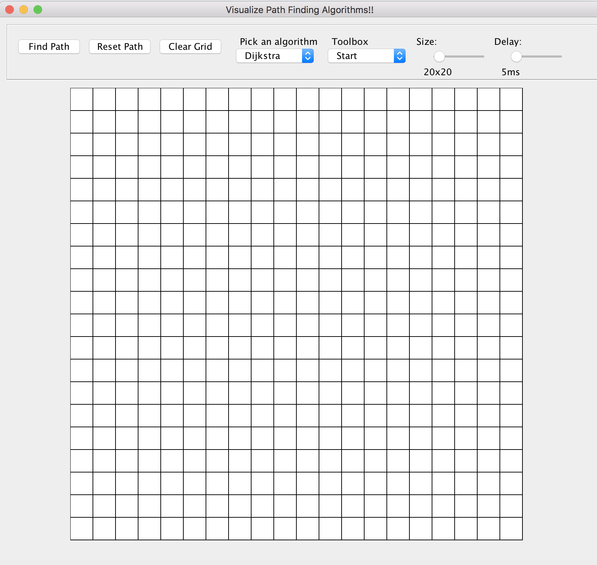

# Path Finding Visualizer

Java application for visualizing pathfinding algorithms. Implemented Dijkstra and A* algorithms with various user-controlled parameters

## Compiling the program
```
javac -d <relative-path-to-class-directory> -sourcepath <relative-path-to-source-directory> <relative-path-to-java-source-file>
```
This command creates a folder and stores the compiled .class files in that folder. In more detail:
1. Specify the path to a folder that will store the compiled .class files using `-d` option
2. Specify the directory where the java source file is and the path to actual java source file using the `-sourcepath` option
#### Example:
```
javac -d src/classes -sourcepath src/PathFinderVisualizer src/PathFinderVisualizer/PathFinder.java
```

## Running the program
```
java -cp <class-path> <class-name>
```
This command navigates to the specified class path, set with `-cp` option, that stores the compiled .class files and runs the .class file of the specified name

#### Exmaple:
```
java -cp src/classes PathFinder
```

## Features


### Pick an algorithm
Pick a path-finding algorithm of your choice using the dropdown menu

### Toolbox
Pick a tool using the dropdown menu:
* Start: Allows the user to set the starting node on the grid. This node will be colored in blue
* End: Allows the user to set the ending node on the grid. This node will be colored in red
* Obstacle: Allows the user to draw any obstacle on the grid. Obstacles will be colored in black
* Eraser: Allows the user to erase anything that had been drawn on the grid

### Size
Adjust the grid size

### Delay
Adjust how long it takes for the nodes to be explored. Short delay means less time to find the final path. Longer delay means longer time to find the final path, but allows a more detailed observation on the nodes being explored by the path-finding algorithm.

### Find Path
Start finding the path from the starting node to the ending node. For this command to execute, both the starting node and ending node have to be set on the grid

### Reset Path
After a path had been found, use this command to clear the path and the nodes that have been explored. Obstacles, as well as starting and ending nodes will stay on the grid

### Clear Grid
Everything on the grid will be cleared
